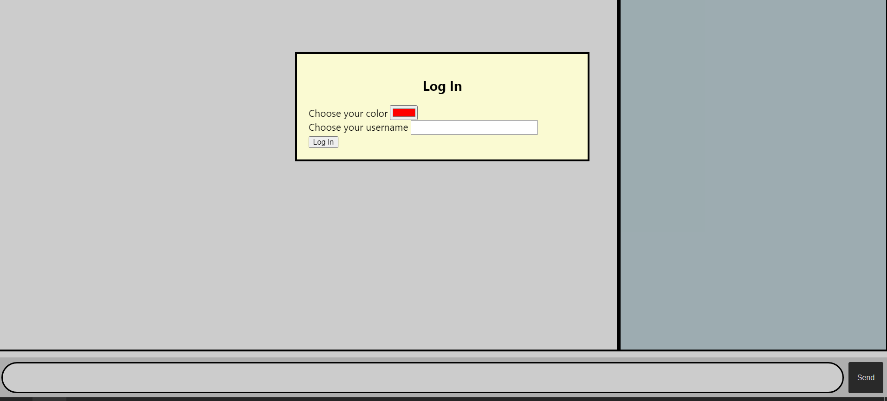
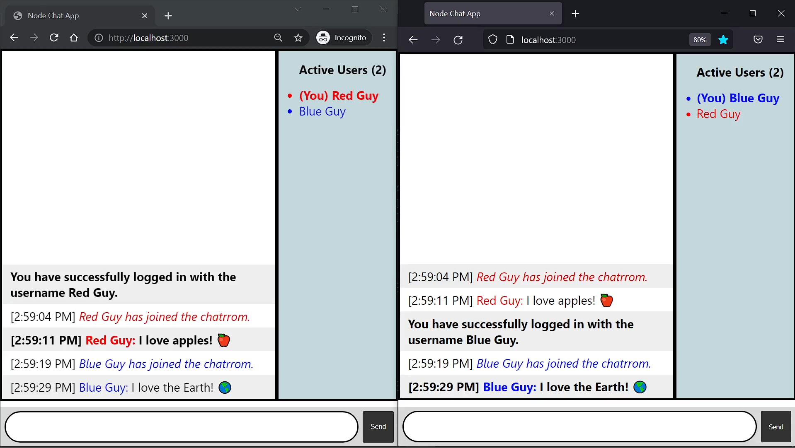

# Socket.io and Node.js Chat app

A very simple chat app I made for school. Uses Node.js, Express and Socket.io.

# How to run

Make sure [you have Node.js installed](https://nodejs.org/en/).

Run `npm install` to install any misisng dependencies. Then, run `node index.js`, and access `http://localhost:3000/` in your browser.

# Description / How to Use

This is a chat app that supports multiple end user clients communicating with each other. You can see this by opening multiple tabs on the same/different browsers. From the app, you can send messages, view messages, and view a list of active users. The current user's name is presented as the first, bolded bullet point in the active user list (prefixed with "(You)").

To change username: enter `/nick NEWNAME` where NEWNAME is the username you are changing to. For example, `/nick Ace` to change your nickname to Ace. You cannot log in with, or change your username to, a username that is or was previously in use.

To change color: enter `/nickcolor NEW` or `/nickcolour NEW`, where `NEW` is a hexadecimal RGB string. For the sake of convenience, the leading `#` is optional; which means that both `/nickcolor AABBCC` and `/nickcolor #AABBCC` are valid.

## Acknowledgments

The basis for this assignment was the recommended tutorial to follow on socket.io that can be found here: https://socket.io/get-started/chat/

Additionally, with regards to the login window (a popup modal): https://www.w3schools.com/howto/howto_css_modals.asp was heavily used for inspiration.